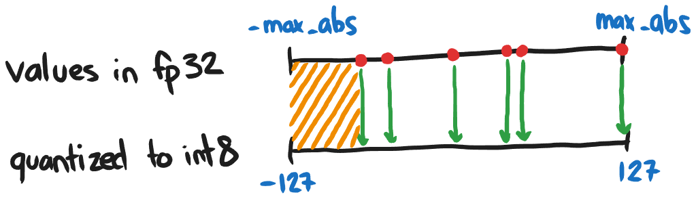
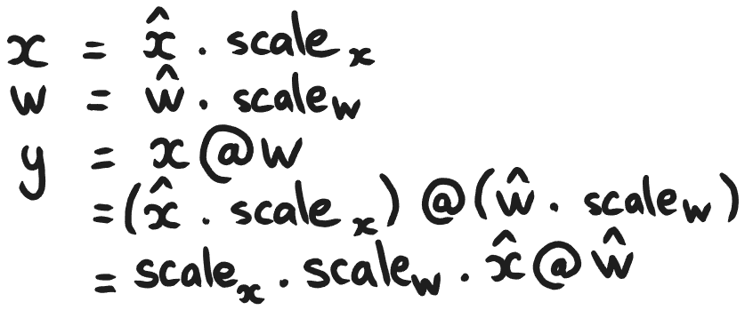
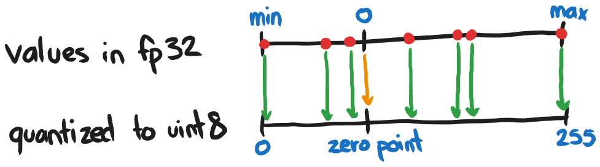
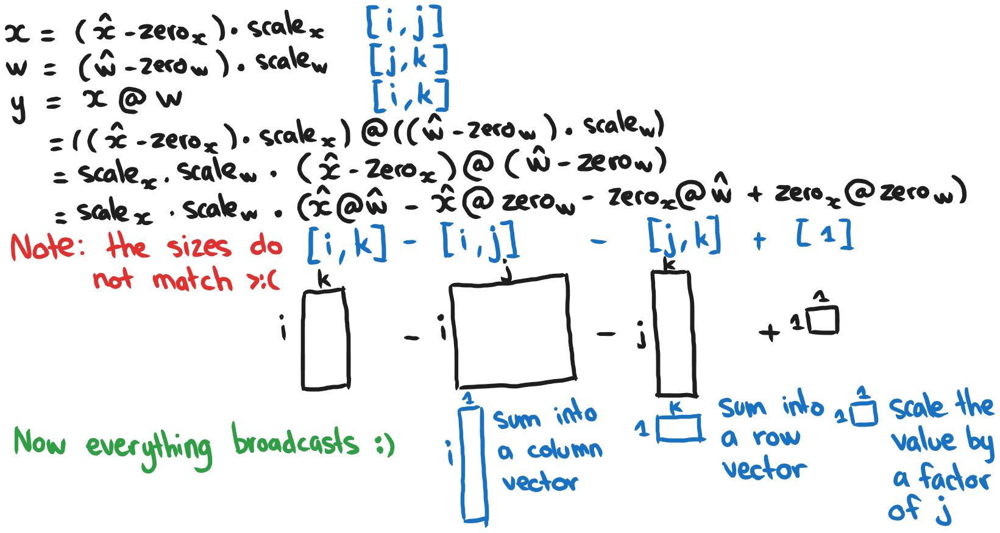

# Bag of Holding (aka. Quantization)

## results
| Model                | Accuracy | Size (bytes) |
|----------------------|----------|--------------|
| Base fp32            | 0.9468   | 560424       |
| Quantized int8       | 0.9464   | 140712       |

## formulas

